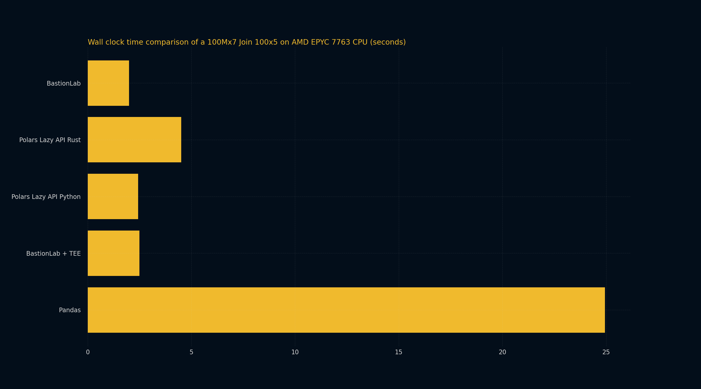

# Polars
_________________________________

## Benchmarks:
_________________________________________________

### Benchmarking a 10Mx7 JOIN 100x5

The data below demonstrates that BastionLab can complete operations faster than existing solutions. It is comparable to Polars as Polars is what BastionLab uses under the hood. 

On the following Join operation, BastionLab is 7.15x faster than Pandas without a TEE and 5.12x faster than Pandas when run within a TEE.

|                        | Privacy                           | Processor      | Memory Usage (MB) | Standard deviation of Time | Mean Execution Time | Operation  | Total Runs (Same Parameters) | Cores | Memory |
| ---------------------- | --------------------------------- | -------------- | ----------------- | -------------------------- | ------------------- | ---------- | ---------------------------- | ----- | ------ |
| BastionLab + TEE       | SEV (Encryption) + Access Control | AMD EPYC 7763v |                   | 0.15951                    | 2.29914 s           | INNER JOIN | 10                           | 16    | 64 GB  |
| BastionLab             | Access Control                    | AMD EPYC 7763v | 12068.93436       | 0.06813                    | 1.64691 s           | INNER JOIN | 10                           | 16    | 64 GB  |
| Polars Lazy API Python |                                   | AMD EPYC 7763v | 16514.42188       | 0.05930                    | 1.97007 s           | INNER JOIN | 10                           | 16    | 64 GB  |
| Pandas                 |                                   | AMD EPYC 7763v | 18422.98438       | 0.54693                    | 11.78010 s          | INNER JOIN | 10                           | 16    | 64 GB  |
| Polars Lazy API Rust   |                                   | AMD EPYC 7763v | 11267.53197       | 0.05090                    | 1.884 s             | INNER JOIN | 10                           | 16    | 64 GB  |

### Benchmarking a 100Mx7 JOIN 100x5

With a larger Join operation, BastionLab is 12.5x faster than Pandas without a TEE and 10x faster than Pandas when run within a TEE. It is still comparable to Polars in this operation as well.

|                        | Privacy                           | Processor      | Memory Usage (MB) | Standard deviation of Time | Mean Execution Time | Operation  | Total Runs (Same Parameters) | Cores | Memory |
| ---------------------- | --------------------------------- | -------------- | ----------------- | -------------------------- | ------------------- | ---------- | ---------------------------- | ----- | ------ |
| BastionLab + TEE       | SEV (Encryption) + Access Control | AMD EPYC 7763v |                   | 0.07252                    | 2.49139 s           | INNER JOIN | 10                           | 16    | 64 GB  |
| BastionLab             | Access Control                    | AMD EPYC 7763v | 22275.93819       | 0.05010                    | 1.99522 s           | INNER JOIN | 10                           | 16    | 64 GB  |
| Polars Lazy API Python |                                   | AMD EPYC 7763v | 18120.21875       | 0.13787                    | 2.43374 s           | INNER JOIN | 10                           | 16    | 64 GB  |
| Pandas                 |                                   | AMD EPYC 7763v | 18791.93359       | 0.65590                    | 24.94570 s          | INNER JOIN | 10                           | 16    | 64 GB  |
| Polars Lazy API Rust   |                                   | AMD EPYC 7763v | 14339.72344       | 0.05216                    | 4.507 s             | INNER JOIN | 10                           | 16    | 64 GB  |

The memory benchmarks were tracked differently accross rust applications and python application. To be fair we recommend comparing (python) Polars Python against Pandas and (rust) BastionLab against Polars Rust.

Based on the above benchmarks we see that BastionLab performs operations faster than available solutions. There is a slight overhead when using BastionLab within a TEE but it is still as fast as Polars and much faster than Pandas.
